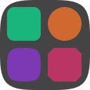
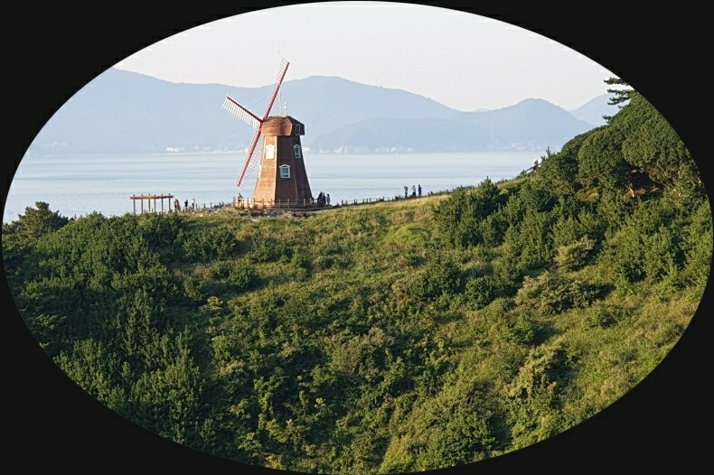
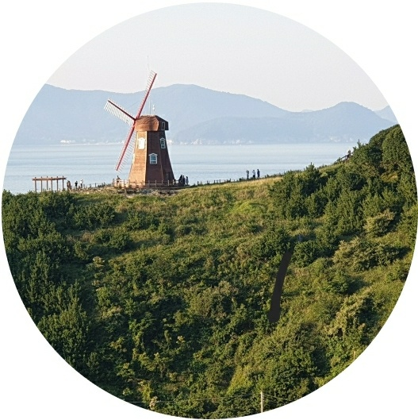
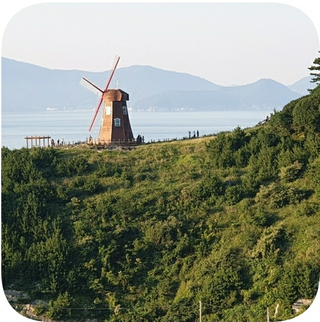
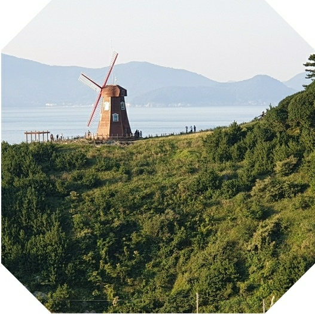
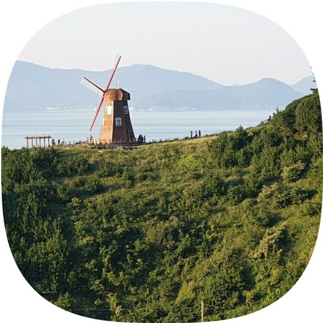

# ShapedImageView

  [](https://github.com/woongdev/ShapedImageView/actions/workflows/build.yml) [](https://search.maven.org/artifact/io.woong.shapedimageview/shapedimageview) [](./LICENSE) [](https://devlibrary.withgoogle.com/products/android/repos/woongdev-ShapedImageView) [](https://github.com/woongdev)

<br>
<p align="center">
    
</p>
<br>

ShapedImageView is an Android library which provides a simple way to use various shapes of imagview.
It contains some predefined shapes like oval, round-rectangle or cut-corner-rectangle.
And it support custom shape API.

## Features

- **Various Shape ImageViews:** There are various imageviews.
For instance, OvalImageView or CutCornerImageView.
- **Custom Shape Support:** This library contains FormulableImageView.
It can accept formula to draw custom image shape.
You can use predefined formula or you can create your custom formula by inherit interface.
- **Border and Shadow:** All imageviews in this library have border and shadow related attributes.
- **Scale Type Support**: Scale type `Matrix`, `FitXY` and `CenterCrop` is supported for all imageviews. After Android SDK 31, all scale types are supported.

## Installation

```groovy
implementation "io.woong.shapedimageview:shapedimageview:$version"
```

## Getting Started



Let's create a imageview like sample image.
You can get this shape in simple way using below code.

```xml
<io.woong.shapedimageview.widget.OvalImageView
    android:layout_width="300dp"
    android:layout_height="200dp"
    android:src="@drawable/sample" />
```

## Documentation

- [Shapes](#shapes)
- [Scale Types](#scale-types)
- [Attributes](#attributes)
- [Custom Shape using Formula](#custom-shape-using-formula)
- [Predefined Formula](#predefined-formula)

### Shapes

| View Class Name | Preview | Description |
| ---- | --------| ----------- |
| OvalImageView |  | An oval shape imageview. |
| RoundImageView |  | A rectangle imageview that has rounded corners. |
| CutCornerImageView |  | A rectangle imageview that has cutted corners. |
| FormulableImageView |  | A special imageview that draw user-custom shape using `Formula` interface. |

In this library, there are various predefined shaped imageviews.
They are `OvalImageView`, `RoundImageView` and `CutCornerImageView`.
And there is a special view, `FormulableImageView`.
It can accept a `Formula` and draw shape according to `Formula`.
To check how to use `Formula`, go to [Custom Shape](#custom-shape-using-formula) section.

### Scale Types

ShapedImageView library supports scale types.

| Scale Type | Supported |
| ---------- | :-------: |
| Matrix | O |
| FitXY | O |
| FitStart | Only after Android 31 |
| FitCenter | Only after Android 31 |
| FitEnd | Only after Android 31 |
| Center | Only after Android 31 |
| CenterCrop | O |
| CenterInsize | Only after Android 31 |

`Matrix`, `FitXY` and `CenterCrop` is supported in all Android API.
Other scale types are supported only after Android 31.

### Attributes

| View | Attribute Name | Type | Default |
| ---- | --------- | ---- | ------- |
| All | border_size | Dimension | 0 |
| All | border_color | Color | #444444 |
| All | border_enabled | Boolean | true |
| All | shadow_size | Dimension | 0 |
| All | shadow_color | Color | #888888 |
| All | shadow_enabled | Boolean | true |
| CutCornerImageView | cut_size | Dimension | 16dp |
| CutCornerImageView | top_left_cut_size | Dimension | 16dp |
| CutCornerImageView | top_right_cut_size | Dimension | 16dp |
| CutCornerImageView | bottom_right_cut_size| Dimension | 16dp |
| CutCornerImageView | bottom_left_cut_size | Dimension | 16dp |
| RoundImageView | radius | Dimension | 16dp |
| RoundImageView | top_left_radius | Dimension | 16dp |
| RoundImageView | top_right_radius | Dimension | 16dp |
| RoundImageView | bottom_right_radius| Dimension | 16dp |
| RoundImageView | bottom_left_radius | Dimension | 16dp |
| FormulableImageView | shape_formula | String | |

`radius` and `cut_size` has the lowest priority.
It means you can override radius value using specific corner attribute.

`shape_formula` attribute can accept formated string.
To check how to use it, go to [Custom Shape](#custom-shape-using-formula) section.

### Custom Shape using Formula

ShapedImageView support custom shape imageview.
There is `FormulableImageView` and `Formula` to draw custom shape.

The Formula interface is a kind of mathematical function.
It can accept angle and it has a method that returns the x and y coordinate position for current angle.

FormulableImageView draw a shape while changing the angle from 0 to 360 degrees in the given Formula.

To use Formula, create a class that inherit from Formula interface and set it to FormulableImageView.

1. Define your custom formula.

```kotlin
class CustomFormula : Formula {
    override var degree: Float = 0f
        set(value) {
            field = if (value > 360) {
                value % 360
            } else {
                value
            }
        }

    override var rect: RectF = RectF()

    override fun getX(): Float {
        ...
    }

    override fun getY(): Float {
        ...
    }
}
```

2. Set custom formula to imageview.
   There are 2 way to set formula to FormulableImageView,
   code and XML.

```kotlin
// Kotlin Code.
val image = findViewById<FormulableImageView>(R.id.image)
image.formula = CustomFormula()
```

```java
// Java Code.
FormulableImageView image = findViewById(R.id.image);
image.setFormula(new CustomFormula());
```

```xml
<!-- Absolute Path -->
<io.woong.shapedimageview.FormulableImageView
    android:layout_width="200dp"
    android:layout_height="200dp"
    android:src="@drawable/sample"
    app:shape_formula="com.example.app.CustomFormula"/>

<!-- Relative Path -->
<io.woong.shapedimageview.FormulableImageView
    android:layout_width="200dp"
    android:layout_height="200dp"
    android:src="@drawable/sample"
    app:shape_formula=".CustomFormula"/>
```

### Predefined Formula

There are 2 formula already in this library.
One is `EllipseFormula` and another is `SuperEllipseFormula`.

You can use these predefined formulas for drawing special shapes.
Or you can check them as reference of inherit `Formula`.

You can set predefined formula like custom formula.

```kotlin
// Kotlin Code.
val image = findViewById<FormulableImageView>(R.id.image)
image.formula = SuperEllipseFormula(4f)
```

```java
// Java Code.
FormulableImageView image = findViewById(R.id.image);
image.setFormula(new SuperEllipseFormula(4f));
```

You can set predefined formula using absolute path.
But, you can pass just a name when using predefined formula.

```xml
<io.woong.shapedimageview.FormulableImageView
    android:layout_width="200dp"
    android:layout_height="200dp"
    android:src="@drawable/sample"
    app:shape_formula="SuperEllipseFormula"/>
```

Or you can use string resources.

```xml
<io.woong.shapedimageview.FormulableImageView
    android:layout_width="200dp"
    android:layout_height="200dp"
    android:src="@drawable/sample"
    app:shape_formula="@string/shapedimageview_superellipse_formula"/>
```

## License

ShapedImageView is licensed under the [MIT License](./LICENSE).