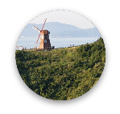
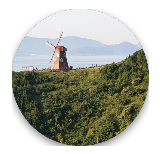
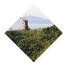
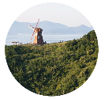
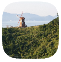
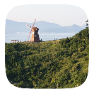

<div align="center">
    
    
    <a href="https://github.com/woongdev/ShapedImageView/actions/workflows/build.yml">
        
    </a>
    <a href="https://search.maven.org/artifact/io.woong.shapedimageview/shapedimageview">
        
    </a>
    <a href="https://devlibrary.withgoogle.com/products/android/repos/woongdev-ShapedImageView">
        
    </a>
    <a href="./LICENSE">
        
    </a>
    <h1>ShapedImageView</h1>
    <p>ShapedImageView is an open source Android library for using various shape image views easily.</p>
    <p></p>
</div>

## Installation

```groovy
implementation "io.woong.shapedimageview:shapedimageview:$version"
```

## Shapes

Currently, there are 4 shapes (circle, square, rounded square, squircle).

Each shaped image views are implemented in `CircularImageView`, `SquareImageView`, `RoundedSquareImageView` and `SquircularImageView`.

| Shape | View Class | Preview |
| --- | --- | --- |
| Circle | CircularImageView |  |
| Square | SquareImageView |  |
| Rounded Square | RoundedSquareImageView |  |
| Squircle | SquircularImageView |  |

## Getting Started

### Layout

```xml
<io.woong.shapedimageview.widget.CircularImageView
    android:layout_width="150dp"
    android:layout_height="150dp"
    android:src="@drawable/sample" />

<io.woong.shapedimageview.widget.SquareImageView
    android:layout_width="150dp"
    android:layout_height="150dp"
    android:src="@drawable/sample" />

<io.woong.shapedimageview.widget.RoundedSquareImageView
    android:layout_width="150dp"
    android:layout_height="150dp"
    android:src="@drawable/sample"
    app:shaped_imageview_radius="16dp" />

<io.woong.shapedimageview.widget.SquircularImageView
    android:layout_width="150dp"
    android:layout_height="150dp"
    android:src="@drawable/sample"
    app:shaped_imageview_curvature="50" />
```

You can use ShapedImageViews in xml layout like upper codes.

## Attributes

All attributes have `shaped_imageview` prefix.

| View | Attribute Name | Type | Default |
| --- | --- | --- | --- |
| All | shaped_imageview_shadow_enabled | Boolean | true |
| All | shaped_imageview_shadow_size | Dimension | 0dp |
| All | shaped_imageview_shadow_adjust_enabled | Boolean | true |
| All | shaped_imageview_shadow_color | Color | #888888 |
| All | shaped_imageview_shadow_gravity | center,<br> left, top, right, bottom,<br>top_left, top_right,<br>bottom_right, bottom_left | center |
| All | shaped_imageview_border_enabled | Boolean | true |
| All | shaped_imageview_border_size | Dimension | 0dp |
| All | shaped_imageview_border_color | Color | #444444 |
| RoundedSquareImageView | shaped_imageview_radius | Dimension | 0dp |
| SquircularImageView | shaped_imageview_curvature | Integer | 50 (0 ~ 100) | 

### shaped_imageview_shadow_adjust_enabled

`shaped_imageview_shadow_adjust_enabled` determines that using resize imageview's size according to shadow size.
Default is `true`.

If it is `false`, shadow could be cutted.

| True | False |
| --- | --- |
|  |  |

### shaped_imageview_curvature 
`shaped_imageview_curvature` is an attribute of `SquircularImageView`.
It determines how much curve it is.

It can accept 0 ~ 100. If curvature is 0, it shapes like diamond. If curvature is 100, it almost shpaes like a rounded square.

| 0 | 25 | 50 | 75 | 100 |
| --- | --- | --- | --- | --- |
|  |  |  |  |  |

## Limitations

- Scale type: Only can use `CENTER_CROP`.
- Size: Width and height size always same.

## Contributing

If you find bugs or want to suggest ideas or want to request features? Please create issues!

And always welcome to pull requests!

## Changelog

Detail changes is written in [changelog file](./CHANGELOG.md).

## License

ShapedImageView by [Jaewoong Cheon](https://github.com/woongdev) is licensed under the [MIT License](./LICENSE).