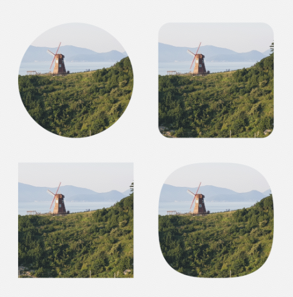
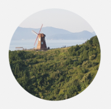
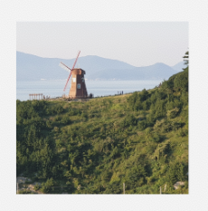
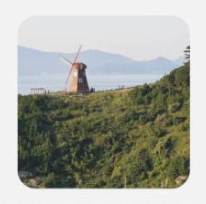

<div align="center">
    
    
    <a href="./LICENSE"></a>
    <h1>ShapedImageView</h1>
    <p>ShapedImageView is an open source Android library for using various shape image views easily.</p>
    <p></p>
</div>

## Installation

```groovy
implementation "io.woong.shapedimageview:shapedimageview:$version"
```

## Shapes

Currently, there are 4 shapes (circle, square, rounded square, squircle).

Each shaped image views are implemented in `CircularImageView`, `SquareImageView`, `RoundedSquareImageView` and `SquircularImageView`.

| Shape | View Class | Preview |
| --- | --- | --- |
| Circle | CircularImageView |  |
| Square | SquareImageView |  |
| Rounded Square | RoundedSquareImageView |  |
| Squircle | SquircularImageView |  |

## Getting Started

### Layout

```xml
<io.woong.shapedimageview.widget.CircularImageView
    android:layout_width="150dp"
    android:layout_height="150dp"
    android:src="@drawable/sample" />

<io.woong.shapedimageview.widget.SquareImageView
    android:layout_width="150dp"
    android:layout_height="150dp"
    android:src="@drawable/sample" />

<io.woong.shapedimageview.widget.RoundedSquareImageView
    android:layout_width="150dp"
    android:layout_height="150dp"
    android:src="@drawable/sample"
    app:shaped_imageview_radius="16dp" />

<io.woong.shapedimageview.widget.SquircularImageView
    android:layout_width="150dp"
    android:layout_height="150dp"
    android:src="@drawable/sample"
    app:shaped_imageview_curvature="50" />
```

### Attributes

All attributes have `shaped_imageview` prefix.

| View | Attribute | Type | Default | Limitation |
| --- | --- | --- | --- | --- |
| RoundedSquareImageView | shaped_imageview_radius | Dimension | 0dp | |
| SquircularImageView | shaped_imageview_curvature | Integer | 50 | 0 ~ 100 |

## Limitations

- Scale type: Only can use `CENTER_CROP`.
- Size: Width and height size always same.

## Contributing

If you find bugs or want to suggest ideas or want to request features? Please create issues!

And always welcome to pull requests!

## Changelog

Detail changes is written in [changelog file](./CHANGELOG.md).

## License

ShapedImageView by [Jaewoong Cheon](https://github.com/woongdev) is licensed under the [MIT License](./LICENSE).
